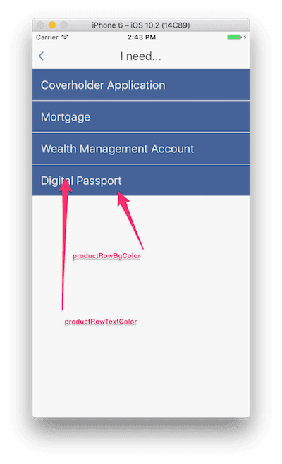

## Styles

See some example styles packs in [../examples/styles](../examples/styles). See below for how the various style properties are reflected in the UI:

*Note: `fontFamily` is not supported at this moment.*

